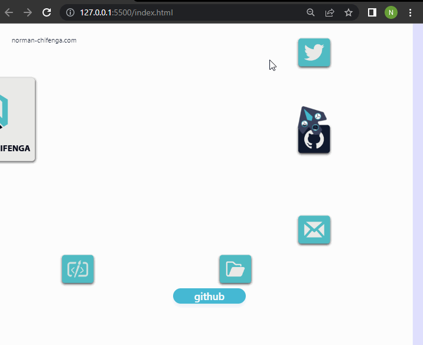

# 2D Desktop

This is a simple 2D Desktop similiar to the on on my portifolio
norman-chifenga.com the different is the fact that this one use
HTML canvas not three.js 

[vist live page here](https://dev.norman-chifenga.com/2d_desktop/)



### INSTRUCTIONS
Clone this repository.

```
https://github.com/norman-chifenga/2d-Desktop
```

finally, locate the index.html and open the file in any browser 